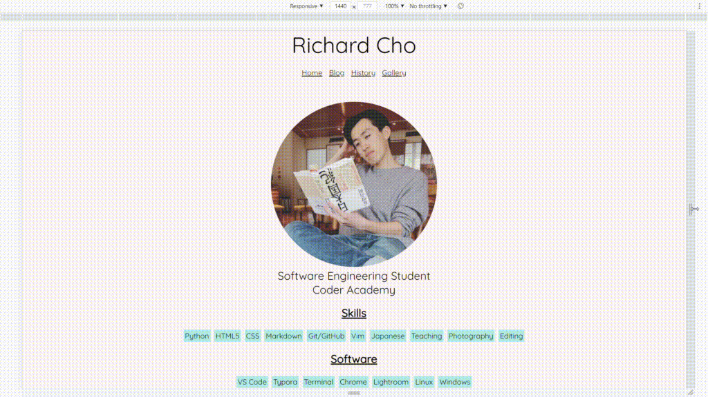
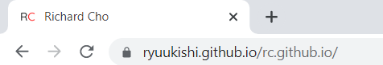
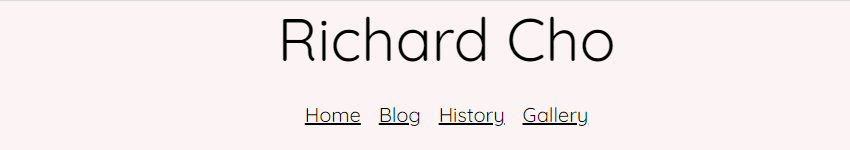
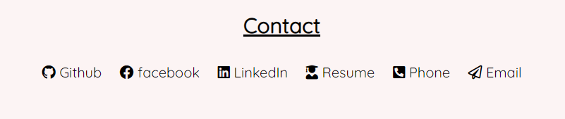
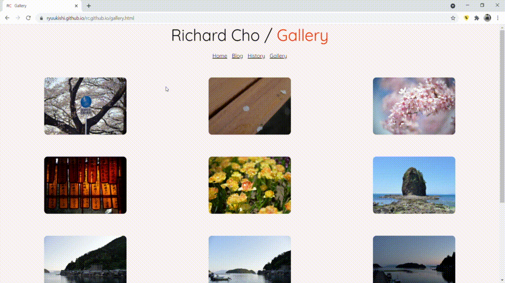

# T1A2 - Portfolio

- [T1A2 - Portfolio](#t1a2---portfolio)
  * [Links](#links)
  * [Purpose & Target Audience](#Purpose and Target Audience)
  * [Functionality / Features](#Functionality and Features)
  * [Sitemap](#sitemap)
  * [Screenshots](#screenshots)
  * [Tech Stack](#tech-stack)

## Links

- [GitHub Repository](https://github.com/Ryuukishi/rc.github.io)

- [Portfolio website](https://ryuukishi.github.io/rc.github.io/)

## Purpose and Target Audience

The purpose of this website is to provide a platform for me to display relevant information about myself to anyone who visits my site — whether that be prospective employers, coworkers, friends and family or people who are just interested about me or what I do. The portfolio should inform the user about my work history, skills and also more personal information information such as hobbies and background. I can use this website to showcase and highlight projects I've been a part of and relevant skills/work experience that would help me in landing a job.

## Functionality and Features

- Responsive design <sup id="a1">[1](#f1)</sup>
- Favicon located on the browser tab <sup id="a2">[2](#f2)</sup>
- Convenient navigation menu located at the top of each page for easy access <sup id="a3">[3](#f3)</sup>
- Intuitive icons that link to various SNS pages in addition to contact info such as phone and email <sup id="a4">[4](#f4)</sup>
- Interactive gallery - photos expand in size when you hover over them <sup id="a5">[5](#f5)</sup>

## Sitemap

```
Home
|   
+-----Blog
|		\---Blog Post 1
|		|
|		\---Blog Post 2
|		|
|		\---Blog Post 3
|		|
|		\---Blog Post 4
|		|
|		\---Blog Post 5
|
+----History
|
+----Gallery
```

## Screenshots

<b id="f1">1</b>[↩](#a1)  Responsive design




<b id="f2">2</b>[↩](#a2)  Favicon




<b id="f3">3</b>[↩](#a3)  Navigation menu



<b id="f4">4</b>[↩](#a4)  SNS/contact info icons



<b id="f5">5</b>[↩](#a5)  Expanding gallery




## Tech Stack

The website is written entirely in HTML/CSS although some 3rd-party resources are used including:

- Google Fonts - Quicksand Font
- Font Awesome Icon Library - used for the SNS/contact info icons located at the bottom of the homepage

The entire website is hosted on GitHub pages which is ideal since I can push any commits to my GitHub repo and the website will be updated with those changes in a matter of seconds. Each HTML page has been validated using the W3C Validator to ensure the pages are error-free. 

